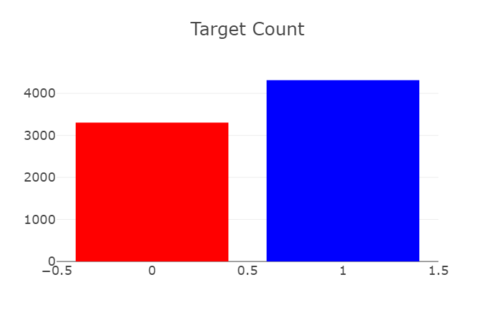
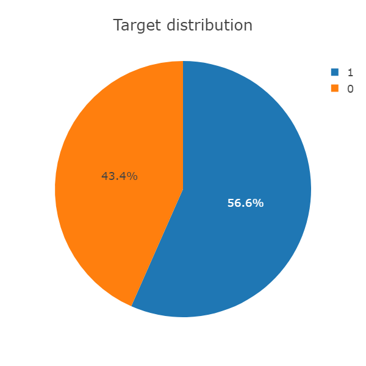
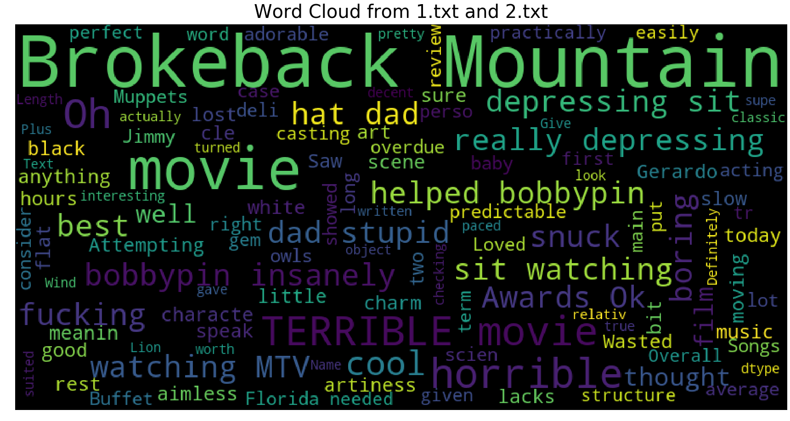
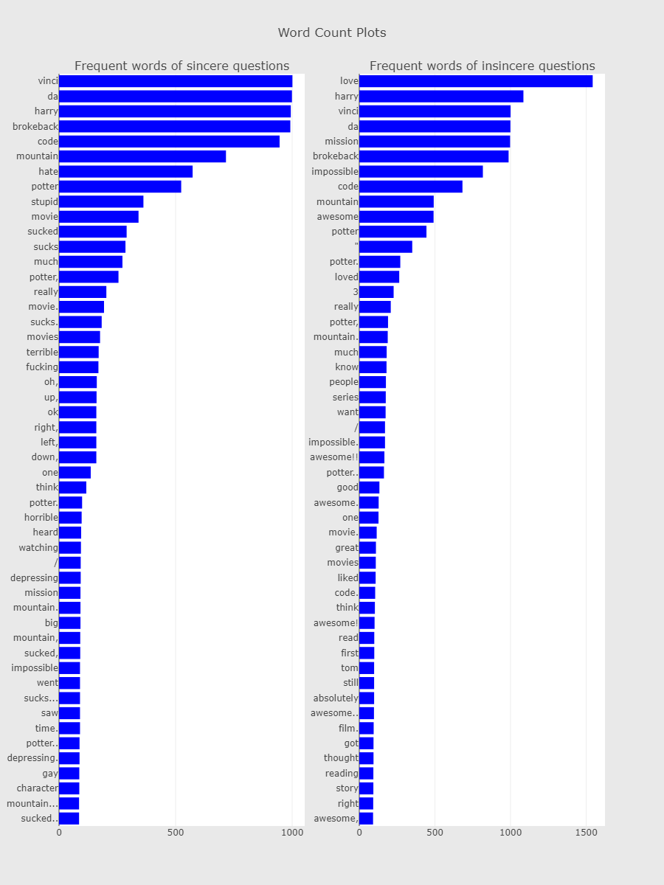
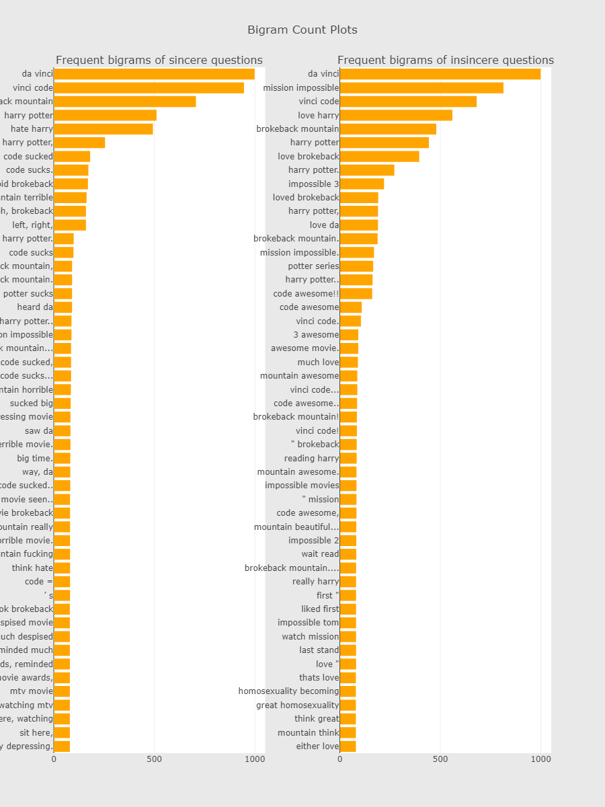
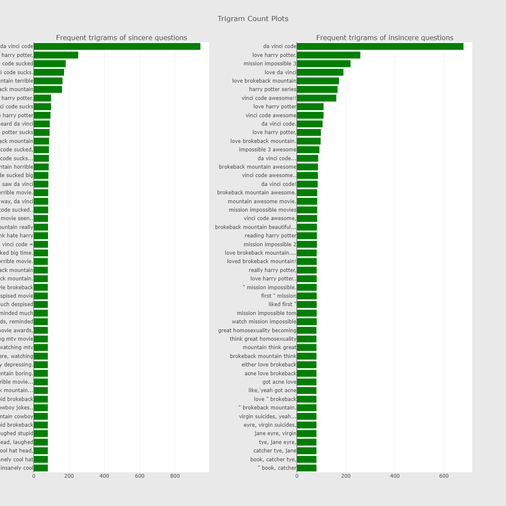
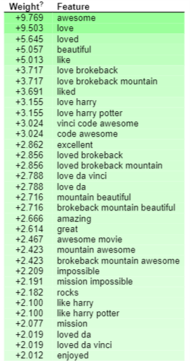
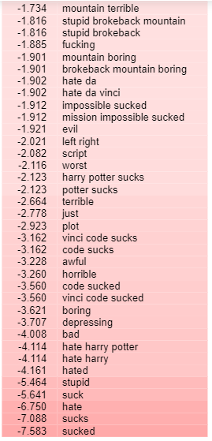
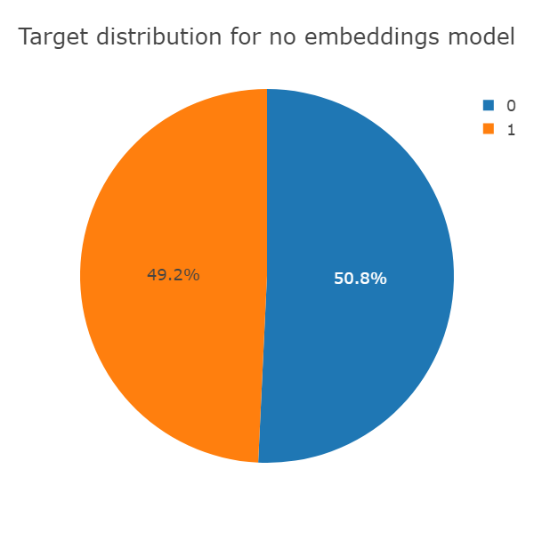
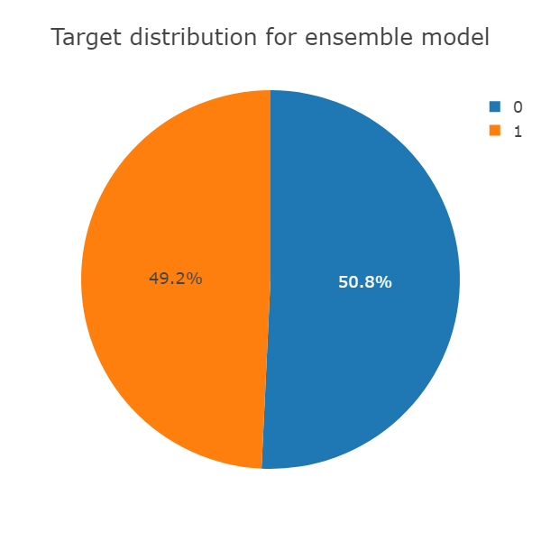

# Riv_task

The task is to predict [3.txt](assignment/3.txt) using the [given](assignment/) datasets.

### Programs and Modules needed : 
1. Python 3.x
2. Jupyter
3. numpy
4. pandas
5. sklearn
6. Keras
7. plotly, matplotlib, seaborn (for visualizations)

8. Used the glove embeddings for vectorization. [Download glove.6B.zip](http://nlp.stanford.edu/data/glove.6B.zip).

9. GPU to run the GRU, else without GPU change `CuDNNGRU` to `GRU` in [model1.ipynb](model1.ipynb).
10. eli5 (for debugging models)

### Designing of the whole task :
1. [EDA](EDA_.ipynb)
2. [Model](model1.ipynb)
3. [Output - 3.txt](3.txt)

## Explanation

### EDA

Combined the two text files, 1.txt and 2.txt to create a training dataframe.

#### Target Values
43.4% is 0 (negative) and 56.6% is 1 (positive)

#### Word Cloud
To visualize some important and repeating words.

#### Word Count plots.
These are necessary to find how the dataset is skewed towards bias if any.
So we found, mostly these reviews are about harry potter and da vinci code movies.
**First column is on bad reviews and Second is on good reviews.**

**Bigram plot to see relevant words together**

**Trigram plot to see some more words and to decide what model to use**

#### After first base model:
Base model was of TFidVectorizer and logistic regression:
Weights for some words,
**Green is for positive** and  **Red is for negative**.

## Model

The final model consists of an **ensemble** of a GRU using `no embeddings` and a GRU with `glove 6 billion words and 300 dimensions embeddings`.
The output from the model is in [3.txt](3.txt).

#### Why the model ?

First I used CuDNNGRU as its good for learning long term dependencies in sentences. I tried various other models but GRU had the best precision recall score.
The model was good, *but it considered da vinci as a good word, but its a name*, therefore, I decided to use ensembling.
To know unknown words and to make sense of movies like da vinci and other names and relation between words, so I decided to use word embeddings.

#### Accuracy measure :

I used the `F1 Score` because the F1 score can be interpreted as a weighted average of the precision and recall, where an F1 score reaches its best value at 1 and worst score at 0. The relative contribution of precision and recall to the F1 score are equal.
So I used it to determine the best value for a threshold to get weights for the predicted values(reference [here](https://stats.stackexchange.com/questions/274807/how-to-improve-f1-score-with-skewed-classes))

**The final accuracy was 0.9454 or 94.54% on the validation set.**

#### How to make the model even better ?
1. More data, the dataset only was around ~8k samples.
2. To use shop review data instead of given movie review data.
3. To use more bigger embeddings like Glove 840 billion 300 dimension embeddings.